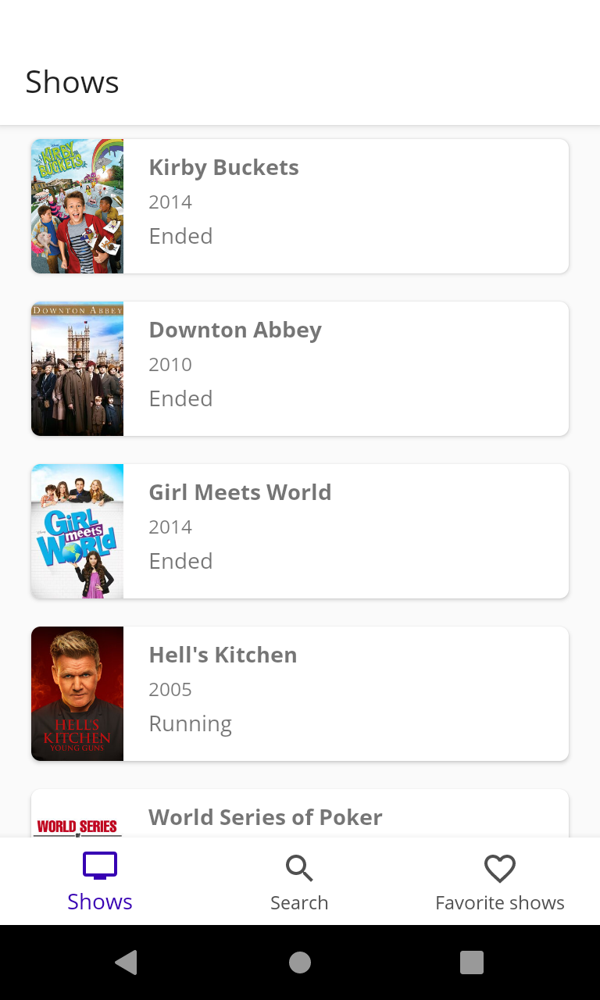

# jobsity-android-challenge

Challenge for Android developer at Jobsity.
Using [TvMaze Api](https://www.tvmaze.com/api).

### 🛠   Tech and skills applied
- Kotlin
- Android Jetpack libraries
- Unit and instrumented (persistence) tests
- Data binding
- MVVM (w/ dependency injection)

### 📱   Mandatory features

[x] List all of the series contained in the API used by the paging scheme provided by the
API.
[x] Allow users to search series by name.
[x] The listing and search views must show at least the name and poster image of the
series.
[x] After clicking on a series, the application should show the details of the series, showing
the following information:

- Name;
- Poster;
- Days and time during which the series airs;
- Genres;
- Summary;
- List of episodes separated by season.

[x] After clicking on an episode, the application should show the episode’s information,
including:
- Name
- Number
- Season
- Summary
- Image, if there is one

---

### ➕   Extra Features
[x] Allow the user to save a series as a favorite.
[x] Allow the user to delete a series from the favorites list.
[x] Allow the user to browse their favorite series in alphabetical order, and click on one to
see its details.